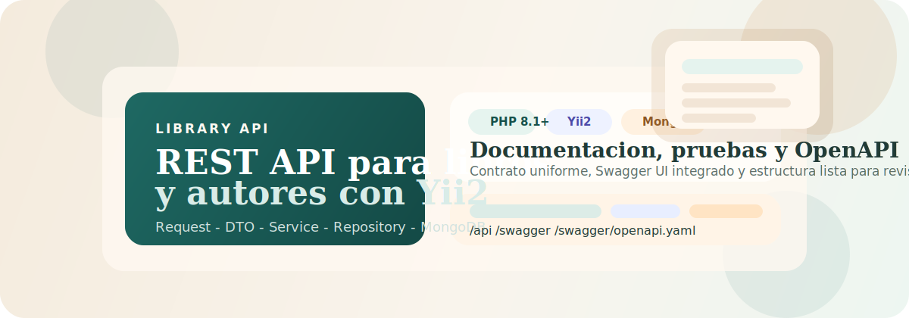
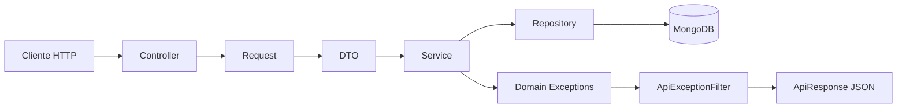

<p align="center">
  
</p>

<h1 align="center">Library API</h1>

<p align="center">
  <strong>API REST para gestionar libros y autores</strong><br />
  Construida con <strong>PHP 8.1+</strong>, <strong>Yii2</strong>, <strong>MongoDB</strong> y <strong>OpenAPI 3.0.3</strong>.
</p>

<p align="center">
  <a href="docs/README.md">
    
  </a>
  <a href="docs/INSTALLATION.md">
    
  </a>
  <a href="docs/USAGE.md">
    
  </a>
  <a href="docs/swagger.yaml">
    
  </a>
</p>

<p align="center">
  
  
  
  
  
  
  
</p>

<p align="center">
  
</p>

<p align="center">
  <sub>API lista para revisión técnica, pruebas locales y documentación interactiva con Swagger UI.</sub>
</p>

---

## ✨ Descripción del proyecto

**Library API** es una API REST enfocada en la gestión de una biblioteca virtual. El proyecto está organizado con una arquitectura por capas que separa claramente transporte HTTP, validación, lógica de negocio y persistencia:

`Controller -> Request -> DTO -> Service -> Repository -> MongoDB`

El repositorio está preparado para revisión técnica con:

- autenticación por bearer token con TTL configurable
- respuestas JSON homogéneas
- documentación OpenAPI modular y Swagger UI integrado
- pruebas automatizadas sobre la aplicación Yii2
- entorno reproducible con Docker Compose

---

## 🎯 Características principales

| Área | Detalle |
| --- | --- |
| Autenticación | `POST /api/login` emite tokens temporales para endpoints protegidos |
| Recursos | CRUD completo para libros y autores |
| Contrato API | Respuesta consistente con `status`, `data`, `meta` y errores tipados |
| Documentación | OpenAPI 3.0.3 bundleado y UI accesible en `/swagger` |
| Arquitectura | Controllers delgados, validación en Requests, reglas en Services y acceso a datos en Repositories |
| Operación local | Arranque con Docker Compose o con PHP local + MongoDB |

---

## 🧰 Tecnologías utilizadas

| Tecnología | Rol en el proyecto |
| --- | --- |
| PHP 8.1+ | Runtime principal |
| Yii2 | Framework web y estructura modular |
| MongoDB | Persistencia de libros, autores y usuarios |
| Symfony YAML | Build del bundle OpenAPI |
| PHPUnit | Suite de pruebas |
| PHP CS Fixer | Revisión de estilo |
| Docker Compose | Entorno local reproducible |

---

## 🎬 Demo local

| Recurso | URL | Propósito |
| --- | --- | --- |
| API root | `http://localhost:8080/api` | Resumen de endpoints y links de documentación |
| Swagger UI | `http://localhost:8080/swagger` | Exploración visual y ejecución de requests |
| OpenAPI YAML | `http://localhost:8080/swagger/openapi.yaml` | Bundle listo para integraciones y revisiones |
| MongoDB | `mongodb://localhost:27017` | Base de datos local expuesta por Docker |

> Si ejecutas la app fuera de Docker, ajusta `MONGO_URI` a `mongodb://localhost:27017/library_db`.

---

## 🏗️ Arquitectura



### Capas clave

- **Controllers**: reciben requests y delegan trabajo sin lógica de negocio.
- **Requests / DTOs**: validan y transportan datos tipados.
- **Services**: aplican reglas de negocio, sincronizan relaciones y lanzan excepciones de dominio.
- **Repositories**: encapsulan queries e índices MongoDB.
- **Responses / Filters**: garantizan un contrato HTTP uniforme.

Más detalle en [docs/ARCHITECTURE.md](docs/ARCHITECTURE.md).

---

## 🚀 Instalación

### Opción A: Docker Compose

```bash
cp .env.example .env
docker compose up --build -d
docker compose exec -T app composer migrate:mongo
```

### Opción B: Local sin Docker

Requisitos:

- PHP 8.1+
- extensión `mongodb`
- Composer
- MongoDB corriendo localmente

```bash
cp .env.example .env
# Cambiar MONGO_URI a mongodb://localhost:27017/library_db
composer install
composer migrate:mongo
composer serve
```

---

## ▶️ Uso

### 1. Levantar la aplicación

```bash
docker compose up --build -d
```

### 2. Ejecutar migraciones

```bash
docker compose exec -T app composer migrate:mongo
```

### 3. Explorar la documentación

- Swagger UI: `http://localhost:8080/swagger`
- OpenAPI: `http://localhost:8080/swagger/openapi.yaml`

### 4. Obtener un token

```bash
curl --request POST "http://localhost:8080/api/login" \
  --header "Content-Type: application/json" \
  --data "{\"username\":\"admin\",\"password\":\"Admin123!\"}"
```

### 5. Consultar un endpoint protegido

```bash
curl --request GET "http://localhost:8080/api/books" \
  --header "Authorization: Bearer <TOKEN>"
```

La guía operativa completa está en [docs/USAGE.md](docs/USAGE.md).

---

## 📁 Estructura del proyecto

```text
.
├── commons/                 # Constantes y helpers compartidos
├── config/                  # Configuración web, consola y MongoDB
├── controllers/             # Controllers web no API (Swagger UI, docs)
├── docker/                  # Dockerfile, nginx y php.ini
├── docs/                    # Documentación técnica y artefactos OpenAPI
├── migrations/mongodb/      # Migraciones e índices MongoDB
├── models/                  # ActiveRecord MongoDB
├── modules/api/             # Módulo principal de la API
│   ├── controllers/         # Endpoints REST
│   ├── docs/openapi/        # Especificación OpenAPI modular
│   ├── dto/                 # DTOs tipados
│   ├── exceptions/          # Excepciones de dominio
│   ├── filters/             # Filtros HTTP (auth, errores)
│   ├── repositories/        # Acceso a datos
│   ├── requests/            # Validación y normalización
│   ├── responses/           # Contrato JSON estándar
│   └── services/            # Casos de uso
├── public/                  # Web root para Docker/Nginx
├── scripts/tools/           # Automatización del bundle OpenAPI
├── tests/                   # Pruebas API, service-level y soporte
└── views/docs/              # Vista personalizada de Swagger UI
```

---

## 📚 Documentación adicional

| Documento | Contenido |
| --- | --- |
| [docs/README.md](docs/README.md) | Índice técnico y mapa de la documentación |
| [docs/INSTALLATION.md](docs/INSTALLATION.md) | Instalación con Docker paso a paso desde cero |
| [docs/USAGE.md](docs/USAGE.md) | Quickstart operativo, login y ejemplos con `curl` |
| [docs/ARCHITECTURE.md](docs/ARCHITECTURE.md) | Capas, flujo request/response y componentes |
| [docs/STYLEGUIDE.md](docs/STYLEGUIDE.md) | Convenciones de código y reglas de mantenimiento |
| [CONTRIBUTING.md](CONTRIBUTING.md) | Guía de contribución y checklist de PR |

---

## 🧪 Testing y calidad

### Ejecutar pruebas

```bash
docker compose exec -T app vendor/bin/phpunit
```

### Generar OpenAPI bundle

```bash
docker compose exec -T app composer openapi:build
```

### Revisar estilo

```bash
docker compose exec -T app composer cs:check
```

Notas:

- La suite de pruebas usa el `MONGO_URI` del entorno activo (`.env` o variables del sistema).
- En un flujo Docker, el valor recomendado es `mongodb://mongo:27017/library_db`.
- El proyecto ya incluye `.gitattributes` para ayudar a estabilizar finales de línea entre Windows y Linux.

---

## 👤 Autor

**Cristian Bravo**  
Desarrollador Full-Stack

---

## 📄 Licencia

Este proyecto se distribuye bajo licencia **MIT**.
